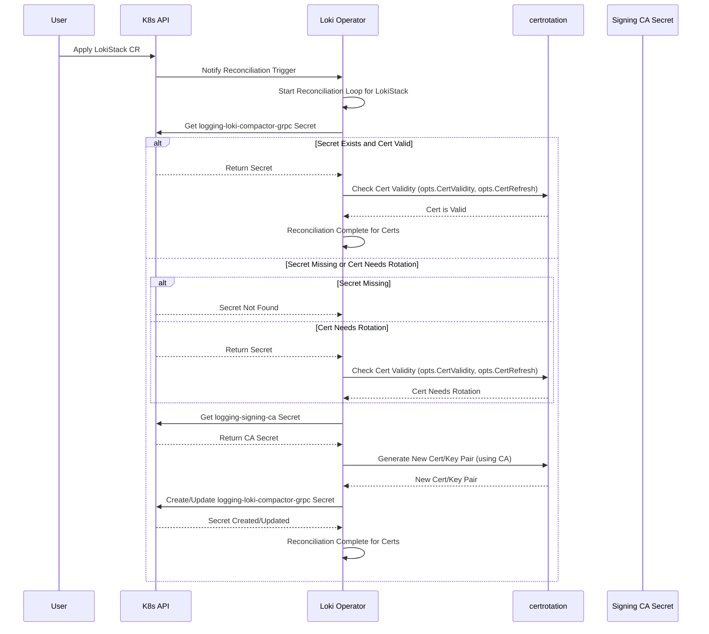

# Loki Operator 中 `logging-loki-compactor-grpc` Secret 分析

本文档分析了 `logging-loki-compactor-grpc` Secret 在 Loki Operator 项目中的管理方式、创建、更新机制及其使用场景和有效期。

## 1. Secret 命名

Secret 的名称是动态生成的，遵循 `<stackName>-<component>-<purpose>` 的模式。

*   `stackName`: 在此场景中是 `logging`。
*   `component`: `compactor`。
*   `purpose`: `grpc`。

此命名逻辑定义在 `operator/internal/certrotation/var.go` 文件中：

```go
// operator/internal/certrotation/var.go
func ComponentCertSecretNames(stackName string) []string {
    return []string{
        // ... 其他组件 ...
        fmt.Sprintf("%s-compactor-grpc", stackName),
        // ... 其他组件 ...
    }
}
```

## 2. Secret 用途

此 Secret 包含用于保护 `logging` LokiStack 实例中 `compactor` 组件 gRPC 端点的 TLS 证书和私钥。

Loki 的其他组件（如 distributor、querier 等）在需要通过 gRPC 与 compactor 通信时，会使用此 Secret 中的证书（通过 Volume 挂载，并结合对应的 CA 证书包 ConfigMap `logging-ca-bundle`）来建立安全的 mTLS 连接。这部分配置体现在 Operator 生成的主 Loki 配置文件中（可参考 `operator/internal/manifests/internal/config/build_test.go` 中的示例）。

## 3. 创建与轮换（更新）流程

下面的 Mermaid 时序图展示了 Loki Operator 如何管理 `logging-loki-compactor-grpc` Secret 的生命周期：



## 4. 创建与轮换（更新）代码逻辑

该 Secret 的生命周期由 Loki Operator 的协调（reconciliation）循环管理，具体逻辑位于 `operator/internal/handlers/lokistack_rotate_certs.go` 文件中。此处理程序利用 `certrotation` 包 (`operator/internal/certrotation/`) 执行以下操作：

*   **检查状态**: 检查 Secret 是否存在，以及其中的证书是否接近过期或根据配置需要刷新。判断依据是配置的证书有效期（`CertValidity`）和刷新周期（`CertRefresh`）。
*   **生成新证书**: 如果需要，会使用该 LokiStack 实例的签名 CA（存储在 `logging-signing-ca` Secret 中）来签发新的证书和密钥对。
*   **应用到集群**: 使用 `controller-runtime` 提供的 `CreateOrUpdate` 函数将期望的 Secret 状态（无论是新建还是更新）应用到 Kubernetes 集群中。

相关代码片段：

```go
// operator/internal/handlers/lokistack_rotate_certs.go
func CreateOrRotateCertificates(ctx context.Context, k client.Client, log logr.Logger, ls *lokiv1beta1.LokiStack, cfg *configv1.ProjectConfig) error {
    // ... 获取当前状态 ...

    // 获取证书选项，包括从 Config 加载的有效期设置
    opts, err := certificates.GetOptions(ctx, k, log, ls)
    if err != nil {
        return err
    }

    // 应用默认设置（如果配置中未指定，则使用包内默认值，但有效期和刷新周期通常需要配置）
    certrotation.ApplyDefaultSettings(&opts, cfg.BuiltInCertManagement)

    // 构建所有期望的证书对象（如果需要轮换，这里会包含新生成的证书）
    objects, err := certrotation.BuildAll(opts)
    if err != nil {
        return fmt.Errorf("failed building certificate objects: %w", err)
    }

    // 将证书对象应用到集群
    for _, obj := range objects {
        if err := ctrl.SetControllerReference(ls, obj, k.Scheme()); err != nil {
            return fmt.Errorf("failed setting controller reference for %s %s: %w", obj.GetKind(), obj.GetName(), err)
        }
        if err := ctrl.CreateOrUpdate(ctx, k, obj, func() error { return nil }); err != nil {
            return fmt.Errorf("failed creating/updating %s %s: %w", obj.GetKind(), obj.GetName(), err)
        }
    }

    // ...
    return nil
}
```

## 5. 有效期与过期时间

证书的有效期 (`CertValidity`) 和刷新阈值 (`CertRefresh`) **并非硬编码在 Go 代码中**，而是通过 Operator 的配置文件进行设置。

*   **配置来源**: 这些值在 Loki Operator 配置的 `BuiltInCertManagement` 部分定义。此配置通常从 Operator 启动时通过 `-config` 命令行标志指定的 YAML 文件加载（例如 `controller_manager_config.yaml`）。相关代码位于 `operator/internal/config/options.go` 和 `operator/cmd/loki-operator/main.go`。
*   **OpenShift 默认值**: 在标准的 OpenShift 部署配置文件 (`operator/config/overlays/openshift/controller_manager_config.yaml`) 中，为目标证书（包括 `logging-loki-compactor-grpc`）设置了明确的默认值：
    *   `certValidity`: `2160h` (即 **90 天**)
    *   `certRefresh`: `1728h` (即 **72 天**，是有效期的 80%)
    ```yaml
    # operator/config/overlays/openshift/controller_manager_config.yaml
    builtInCertManagement:
      enabled: true
      # ... CA settings ...
      # Target certificate validity: 90d
      certValidity: 2160h
      # Target certificate refresh at 80% of validity
      certRefresh: 1728h
    ```
*   **无配置时的行为**: 如果 Operator 启动时**没有**通过 `-config` 提供包含这些值的配置文件，内置证书管理功能将因无法解析空字符串而失败。`operator/internal/config/options.go` 中的 `LoadConfig` 函数在未指定配置文件时返回零值配置。
*   **确定实际值**: 虽然 OpenShift 配置提供了默认值，但最终生效的值取决于 Operator 实际运行时加载的配置。要确定你环境中 `logging-loki-compactor-grpc` Secret 的确切有效期策略，最可靠的方法是检查 Operator 部署所使用的 `ConfigMap` (通常名为 `loki-operator-manager-config`) 或直接检查集群中该 Secret 的 Annotations，特别是 `loki.grafana.com/certificate-not-after`，它记录了计算出的确切过期时间戳。

## 6. 总结

`logging-loki-compactor-grpc` Secret 用于保障 Compactor 组件的 gRPC 通信安全。它由 Loki Operator 根据其配置文件中定义的有效期（OpenShift 默认为 90 天）和刷新周期（OpenShift 默认为 72 天）自动创建和轮换。
