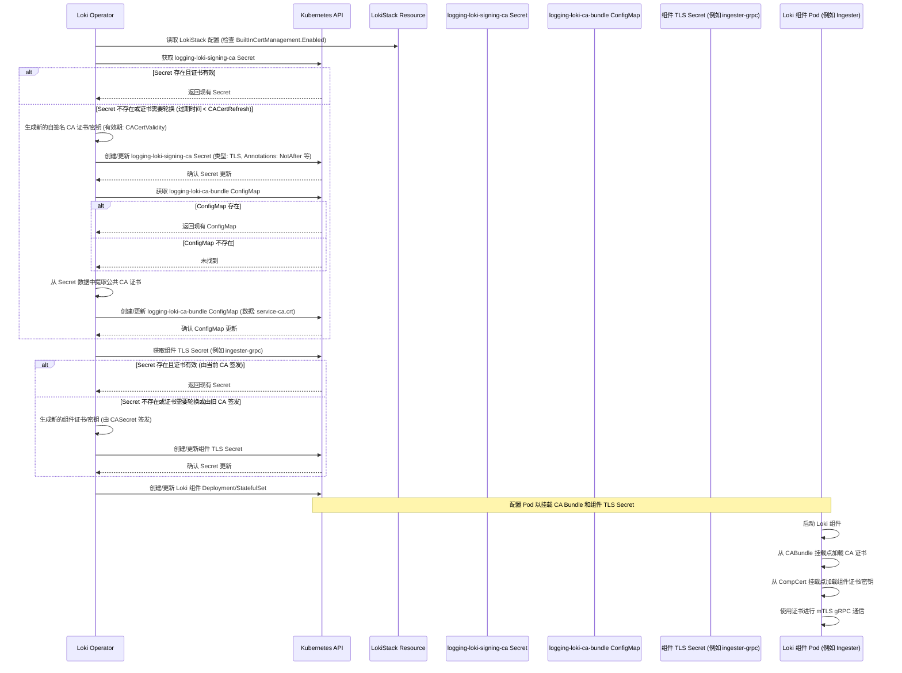

# logging-loki-signing-ca Secret 分析

本文档分析了 `logging-loki-signing-ca` Secret 在 Loki Operator 项目中的管理方式、创建、更新、使用场景及其过期时间。

## 1. 命名规则

Secret 的名称是根据 LokiStack 自定义资源的名称动态生成的。如果 LokiStack 实例名为 `logging-loki`，则对应的 CA Secret 名称为 `logging-loki-signing-ca`。

*   **源代码依据:** `operator/internal/certrotation/var.go`
    ```go
    func SigningCASecretName(stackName string) string {
        return fmt.Sprintf("%s-signing-ca", stackName)
    }
    ```

## 2. 创建机制

当 LokiStack 配置中启用了内置证书管理 (`BuiltInCertManagement.Enabled` 为 `true`) 时，Loki Operator 在协调 (reconciliation) 过程中会自动创建此 Secret。创建的前提是该 Secret 不存在，或者其包含的 CA 证书已接近过期需要轮换。Operator 会生成一个新的自签名 CA 证书和私钥对。

*   **源代码依据:** `operator/internal/certrotation/signer.go` (涉及 `buildSigningCASecret` 函数)
    ```go
    func buildSigningCASecret(opts *Options) (client.Object, error) {
        signingCertKeyPairSecret := newSigningCASecret(*opts)
        // ... 检查是否需要新证书 ...
        if reason := opts.Signer.Rotation.NeedNewCertificate(signingCertKeyPairSecret.Annotations, opts.Rotation.CACertRefresh); reason != "" {
            // 如果需要，则生成新的证书/密钥对
            if err := setSigningCertKeyPairSecret(signingCertKeyPairSecret, opts.Rotation.CACertValidity, opts.Signer.Rotation); err != nil {
                return nil, err
            }
        }
        // ...
        return signingCertKeyPairSecret, nil
    }
    ```

## 3. 更新与轮换 (Rotation)

Operator 会定期检查 CA 证书的有效期。检查依据是 Secret 的 Annotation 中存储的过期时间 (`loki.grafana.com/certificate-not-after`) 以及配置的刷新间隔 (`CACertRefresh`)。如果当前时间距离过期时间小于 `CACertRefresh` 定义的时长，Operator 就会触发证书轮换，生成新的 CA 证书并更新 Secret。

*   **源代码依据:**
    *   `operator/internal/certrotation/signer.go` (使用 `NeedNewCertificate` 进行检查)
    *   `operator/api/config/v1/projectconfig_types.go` (定义了 `CACertRefresh` 的默认值)

## 4. 过期时间与有效期

*   **证书有效期 (`CACertValidity`):** CA 证书的总有效时长，默认值为 **5 年**。
*   **证书刷新间隔 (`CACertRefresh`):** 定义了在证书过期前多久应开始尝试刷新（生成新证书），默认值为 **1 年**。

*   **源代码依据:** `operator/api/config/v1/projectconfig_types.go`
    ```go
    type BuiltInCertManagement struct {
        // ...
        // CACertValidity 定义了自签名 CA 证书的有效时长。
        // 默认为 5 年。
        CACertValidity metav1.Duration `json:"caCertValidity,omitempty"`

        // CACertRefresh 定义了从过期日期算起，应刷新 CA 证书的时间窗口。
        // 默认为 1 年。
        CACertRefresh metav1.Duration `json:"caCertRefresh,omitempty"`
        // ...
    }
    ```

## 5. 使用场景

`logging-loki-signing-ca` Secret 存储的是 Loki Operator 内置证书管理系统的根证书颁发机构 (CA)。其主要作用是为 Loki 各个内部组件（如 Distributor, Ingester, Querier, Compactor 等）之间的通信（主要是 gRPC）提供 mTLS (mutual TLS) 安全保障。

当启用了内置证书管理 (`BuiltInCertManagement.Enabled: true`) 和 gRPC 加密 (`GRPCEncryption: true`) 时，Operator 会执行以下操作：

1.  **管理 CA Secret:** 创建或更新 `logging-loki-signing-ca` Secret。
2.  **签发组件证书:** 使用此 CA 为每个 Loki 组件签发单独的 TLS 证书（例如，证书存储在 `logging-loki-ingester-grpc` 等 Secret 中）。
3.  **创建 CA Bundle:** 创建一个名为 `logging-loki-ca-bundle` 的 ConfigMap，其中包含 CA 的公共证书 (`service-ca.crt`)。
4.  **配置组件:** 配置 Loki 组件的 Pod，挂载对应的组件证书 Secret 和 CA Bundle ConfigMap，使得组件能够：
    *   使用自己的证书向其他组件表明身份。
    *   使用 CA Bundle 验证其他组件证书的有效性，建立安全的 mTLS 连接。

## 6. 时序图 (Sequence Diagram)

