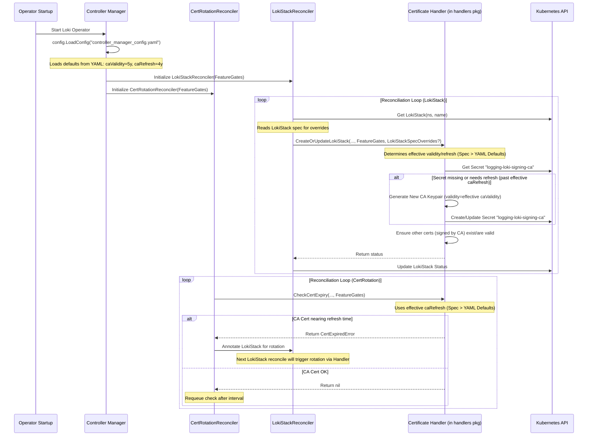

# logging-loki-signing-ca Secret 分析

本文档分析了 `logging-loki-signing-ca` Secret 在 Loki Operator 项目中的管理方式、创建、更新、使用场景及其过期时间。

## 1. 命名规则

Secret 的名称是根据 LokiStack 自定义资源的名称动态生成的。如果 LokiStack 实例名为 `logging-loki`，则对应的 CA Secret 名称为 `logging-loki-signing-ca`。

*   **源代码依据:** `operator/internal/certrotation/var.go`
    ```go
    func SigningCASecretName(stackName string) string {
        return fmt.Sprintf("%s-signing-ca", stackName)
    }
    ```

## 2. 创建机制

当 LokiStack 配置中启用了内置证书管理 (`BuiltInCertManagement.Enabled` 为 `true`) 时，Loki Operator 在协调 (reconciliation) 过程中会自动创建此 Secret。创建的前提是该 Secret 不存在，或者其包含的 CA 证书已接近过期需要轮换。Operator 会生成一个新的自签名 CA 证书和私钥对。**注意：** 创建和轮换逻辑使用的具体有效期 (`CACertValidity`) 和刷新间隔 (`CACertRefresh`) 取决于配置层级（详见第 4 节）。

*   **源代码依据:** `operator/internal/certrotation/signer.go` (涉及 `buildSigningCASecret` 函数)
    ```go
    func buildSigningCASecret(opts *Options) (client.Object, error) {
        signingCertKeyPairSecret := newSigningCASecret(*opts)
        // ... 检查是否需要新证书 ...
        if reason := opts.Signer.Rotation.NeedNewCertificate(signingCertKeyPairSecret.Annotations, opts.Rotation.CACertRefresh); reason != "" {
            // 如果需要，则生成新的证书/密钥对
            if err := setSigningCertKeyPairSecret(signingCertKeyPairSecret, opts.Rotation.CACertValidity, opts.Signer.Rotation); err != nil {
                return nil, err
            }
        }
        // ...
        return signingCertKeyPairSecret, nil
    }
    ```

## 3. 更新与轮换 (Rotation)

Operator 会定期检查 CA 证书的有效期。检查依据是 Secret 的 Annotation 中存储的过期时间 (`loki.grafana.com/certificate-not-after`) 以及配置的刷新间隔 (`CACertRefresh`)。如果当前时间距离过期时间小于 `CACertRefresh` 定义的时长，Operator 就会触发证书轮换，生成新的 CA 证书并更新 Secret。**注意：** 此处使用的 `CACertRefresh` 值同样取决于配置层级（详见第 4 节）。

*   **源代码依据:**
    *   `operator/internal/certrotation/signer.go` (使用 `NeedNewCertificate` 进行检查)
    *   `operator/api/config/v1/projectconfig_types.go` (定义了 `CACertRefresh` 的默认值)

## 4. 过期时间与有效期 (配置层级)

CA 证书的有效期 (`CACertValidity`) 和刷新间隔 (`CACertRefresh`) 的最终生效值取决于以下配置层级：

1.  **LokiStack Spec 优先:** 如果在 `LokiStack` 自定义资源的 `spec.certificateManagement` 字段中明确指定了 `caCertValidity` 或 `caCertRefresh`，则这些值具有最高优先级。
    *   **源代码依据:** `operator/internal/controller/loki/lokistack_controller.go` (在调用证书处理逻辑前会读取 LokiStack Spec)

2.  **Controller Manager Config (YAML) 默认值:** 如果 `LokiStack` Spec 中未指定，Operator 会使用其启动时加载的 `controller_manager_config.yaml` 文件中 `featureGates.builtInCertManagement` 部分定义的默认值。这是 Operator 部署时的全局默认配置。
    *   **证据文件依据:** `wzh.evid/controller_manager_config.yaml` (显示了实际生效的默认值)
        ```yaml
        # wzh.evid/controller_manager_config.yaml
        apiVersion: config.loki.grafana.com/v1
        kind: ProjectConfig
        # ...
        featureGates:
          # ...
          builtInCertManagement:
            enabled: true
            # CA certificate validity: 5 years
            caValidity: 43830h # <--- 默认 5 年有效期
            # CA certificate refresh at 80% of validity
            caRefresh: 35064h # <--- 默认 4 年刷新间隔 (5 年的 80%)
            # Target certificate validity: 90d
            certValidity: 2160h
            # Target certificate refresh at 80% of validity
            certRefresh: 1728h
          # ...
        ```
    *   **源代码依据:** `operator/cmd/loki-operator/main.go` (调用 `config.LoadConfig`) 和 `operator/internal/config/loader.go` (加载 YAML 文件)。加载后的配置通过 `FeatureGates` 结构传递给 Reconciler。

3.  **代码内常量 (最终备用):** 理论上，如果在 `LokiStack` Spec 和 `controller_manager_config.yaml` 中都找不到值，代码内部定义了一些常量作为最终的备用。但在实际部署中，`controller_manager_config.yaml` 通常会提供这些值。
    *   **源代码依据:**
        *   类型定义及注释: `operator/api/config/v1/projectconfig_types.go` (定义结构和字段注释)
            ```go
            type BuiltInCertManagement struct {
                // ...
                // CACertValidity defines the validity duration for the self-signed CA certificate.
                // Defaults to 5 years.
                // +optional
                CACertValidity metav1.Duration `json:"caCertValidity,omitempty"`

                // CACertRefresh defines the time window before the expiration date from which
                // the CA certificate should be refreshed.
                // Defaults to 1 year.
                // +optional
                CACertRefresh metav1.Duration `json:"caCertRefresh,omitempty"`
                // ...
            }
            ```
        *   常量定义: `operator/internal/certrotation/options.go` (定义了备用常量，但 YAML 优先)
            ```go
            const (
                // DefaultCACertValidity defines the default validity duration for the self-signed CA certificate.
                DefaultCACertValidity = 5 * 365 * 24 * time.Hour // 5 years
                // DefaultCACertRefresh defines the default time window before the expiration date from which
                // the CA certificate should be refreshed.
                DefaultCACertRefresh = 1 * 365 * 24 * time.Hour // 1 year
                // ...
            )
            ```
        *   应用逻辑: `operator/internal/certrotation/options.go` (函数 `NewOptions` 会在 *加载的配置* 中缺少值时尝试应用常量，但如果 YAML 中有值，则 YAML 的值优先)。

**总结:** 在 `wzh.evid` 提供的 `controller_manager_config.yaml` 场景下，`logging-loki-signing-ca` 的默认有效期是 **5 年** (`43830h`)，默认刷新间隔是 **4 年** (`35064h`)。

## 5. 使用场景

`logging-loki-signing-ca` Secret 存储的是 Loki Operator 内置证书管理系统的根证书颁发机构 (CA)。其主要作用是为 Loki 各个内部组件（如 Distributor, Ingester, Querier, Compactor 等）之间的通信（主要是 gRPC）提供 mTLS (mutual TLS) 安全保障。

当启用了内置证书管理 (`BuiltInCertManagement.Enabled: true`) 和 gRPC 加密 (`GRPCEncryption: true`) 时，Operator 会执行以下操作：

1.  **管理 CA Secret:** 创建或更新 `logging-loki-signing-ca` Secret。
2.  **签发组件证书:** 使用此 CA 为每个 Loki 组件签发单独的 TLS 证书（例如，证书存储在 `logging-loki-ingester-grpc` 等 Secret 中）。
3.  **创建 CA Bundle:** 创建一个名为 `logging-loki-ca-bundle` 的 ConfigMap，其中包含 CA 的公共证书 (`service-ca.crt`)。
4.  **配置组件:** 配置 Loki 组件的 Pod，挂载对应的组件证书 Secret 和 CA Bundle ConfigMap，使得组件能够：
    *   使用自己的证书向其他组件表明身份。
    *   使用 CA Bundle 验证其他组件证书的有效性，建立安全的 mTLS 连接。

## 6. 时序图 (Sequence Diagram - 更新)


